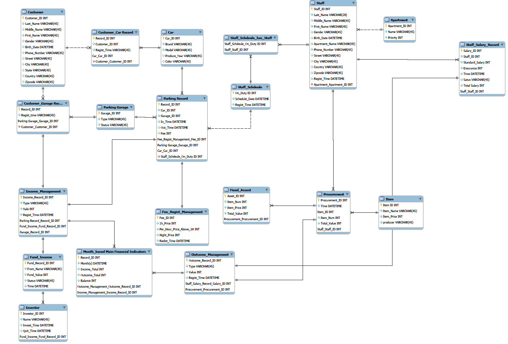
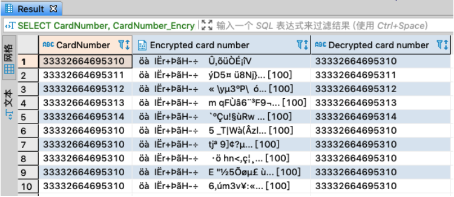

# Database Topic:
With development of technology, unmanned system is trend to all kind of public service. Advanced automation system is reliable and integrable. Due to the background, we would like to create a smart Self-parking system.

## ERD Design:

### Guide:

Step1: Create tables using queries in sql file;

Step2: Import csv data to tables. Since tables have connections based on FK, we suggest you import data by following order. If you don’t want to import all the data by yourself, you can use database ‘GROUP28_TEST’, we did all the things for you. The order:
1. Apartment
2. Car
3. Customer
4. FundIncome
5. Investor
6. Item
7. CustomerCarRecord
8. ParkingGarage
9. CustomerGarageRecord
10. FeeRegistManagement
11. Staff
12. Procurement
13. FixedAsset
14. ParkingRecord
15. IncomeManagement
16. StaffSalaryRecord
17. OutcomeManagement
18. StaffSchedule
19. StaffShedulehasStaff

Step 3: Run the Insert queries to make sure every table’s data is not less than 10 rows.

Step 4: Run ‘stored procedure’ part queries to create the last table ‘MonthBasedMainFinancialIndicators’. We use computed result based on the IncomeManagement table and OutcomeManagement table to fill this last table.

Step 5: Run ‘Encryption’ part queries to use AES_256 create a new column to store the encryption result of the Cardnumber in Staff table. If the system gives you a pop-up warning windows, please click yes. At last, you can run the select query to check the decryption result with the origin data.

Step 6: Run ‘create view’ part queries to create views. We have three views to show the financial detail, parking garage record detail and staff salary detail.

Step 7: Run ‘check constraint function’ part queries to build the constraint based on CustomerCarRecord table. If you want to modify the customerID or carID to a value not in Customer table or CarID, it will fail.